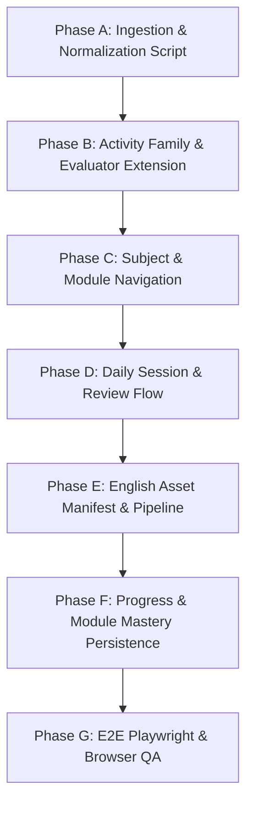

# English Content Analysis & Architecture Report

> **Status:** Analysis & Architecture Only  
> **Scope:** Class 3 English Vocabulary Expansion (958 Unique Words across 8 Modules)  
> **Integrity Guarantee:** Tamil content, activities, evaluators, components, retry behavior, and asset mappings remain 100% untouched.

---

## 1. English Curriculum Overview

The Class 3 English curriculum is designed as a comprehensive, systematic word-learning and spelling program consisting of **8 structured modules** covering **958 unique vocabulary words** (`EW001` through `EW958`).

### Key Pedagogical Dimensions
- **Total Unique Vocabulary:** 958 words (`120 × 7 + 118 = 958`).
- **Module Structure:** 8 weekly modules.
  - **Module 1:** 120 new foundation words (Easy-dominant, no prior review).
  - **Modules 2–7:** 120 new words + 40 systematic review words each.
  - **Module 8:** 118 new words + 40 systematic review words.
- **Pacing & Daily Allocation:**
  - 5 learning days per module (estimated 30 minutes/day).
  - Modules 1–7: **24 new words/day** across Days 1–5.
  - Module 8: **24 new words/day** on Days 1–3, **23 new words/day** on Days 4–5.
  - Modules 2–8: **8 review words/day** across Days 1–5.
  - Daily active session size: **32 items/day** for Modules 2–7; **31–32 items/day** for Module 8.
- **Exposure Volume:**
  - 958 primary learning exposures.
  - 280 spaced review exposures across Modules 2–8.
  - Total scheduled activity instances: **1,238 learning events**.

---

## 2. Source Workbooks Inventory

All source spreadsheets are located in `docs/eng/`. The inventory was verified programmatically:

| # | Filename | Primary Sheet | Additional Sheets | Row Count (Header + Data) |
|---|---|---|---|---|
| 1 | `English_Module_1_120_Word_Implementation_Plan.xlsx` | `Module 1 - 120 Words` | `Difficulty Summary`, `Activity Mix`, `Daily Allocation`, `Design Rules` | 121 (120 data rows) |
| 2 | `English_Module_2_120_NEW_40_REVIEW_PROCESSED.xlsx` | `Module 2 - 120 New Words` | `Module 2 - 40 Review`, `Validation Summary` | 121 (120 new) + 41 (40 rev) |
| 3 | `English_Module_3_120_NEW_40_REVIEW_PROCESSED.xlsx` | `Module 3 - 120 New Words` | `Module 3 - 40 Review`, `Validation Summary` | 121 (120 new) + 41 (40 rev) |
| 4 | `English_Module_4_120_NEW_40_REVIEW_PROCESSED.xlsx` | `Module 4 - 120 New Words` | `Module 4 - 40 Review`, `Validation Summary` | 121 (120 new) + 41 (40 rev) |
| 5 | `English_Module_5_120_NEW_40_REVIEW_PROCESSED.xlsx` | `Module 5 - 120 New Words` | `Module 5 - 40 Review`, `Validation Summary` | 121 (120 new) + 41 (40 rev) |
| 6 | `English_Module_6_120_NEW_40_REVIEW_PROCESSED.xlsx` | `Module 6 - 120 New Words` | `Module 6 - 40 Review`, `Validation Summary` | 121 (120 new) + 41 (40 rev) |
| 7 | `English_Module_7_120_NEW_40_REVIEW_PROCESSED.xlsx` | `Module 7 - 120 New Words` | `Module 7 - 40 Review`, `Validation Summary` | 121 (120 new) + 41 (40 rev) |
| 8 | `English_Module_8_118_NEW_40_REVIEW_PROCESSED.xlsx` | `Module 8 - 118 New Words` | `Module 8 - 40 Review`, `Validation Summary`, `Difficulty Summary`, `Activity Summary`, `Daily Allocation` | 119 (118 new) + 41 (40 rev) |
| 9 | `EW001_EW958_FINAL_CONSOLIDATED_VERIFIED_MASTER.xlsx` | `EW001-EW958 Consolidated` | `Validation Summary` | 959 (958 data rows) |

---

## 3. Module Coverage Analysis

Each module workbook was analyzed for unique identifiers, internal duplicate IDs, overlap with prior modules, and cumulative progression:

| Module | New Words | ID Range | Unique IDs | Duplicate IDs | Overlap w/ Prior Modules | Cumulative Words |
|---|---|---|---|---|---|---|
| **Module 1** | 120 | EW002 – EW945 | 120 | 0 | 0 | 120 |
| **Module 2** | 120 | EW001 – EW956 | 120 | 0 | 0 | 240 |
| **Module 3** | 120 | EW007 – EW954 | 120 | 0 | 0 | 360 |
| **Module 4** | 120 | EW012 – EW942 | 120 | 0 | 0 | 480 |
| **Module 5** | 120 | EW029 – EW958 | 120 | 0 | 0 | 600 |
| **Module 6** | 120 | EW003 – EW936 | 120 | 0 | 0 | 720 |
| **Module 7** | 120 | EW010 – EW946 | 120 | 0 | 0 | 840 |
| **Module 8** | 118 | EW006 – EW947 | 118 | 0 | 0 | **958** |

### Key Findings
1. **Zero Overlap:** No two modules share a new word. The intersection between any two module new-word sets is empty (`∅`).
2. **Zero Internal Duplicates:** Every module has 100% unique IDs among its new words.
3. **Non-Contiguous Numbering:** The ID numbers `EW001–EW958` are not allocated in strict sequential blocks per module (e.g. Module 1 contains both `EW002` and `EW945`). The modules represent pedagogical groupings (by difficulty and thematic progression) rather than numeric ID ranges.

---

## 4. 958-Word Coverage Validation (Master vs Modules)

Cross-validation between `EW001_EW958_FINAL_CONSOLIDATED_VERIFIED_MASTER.xlsx` and the 8 module workbooks yielded exact correspondence:

- **Master Record Count:** 958 rows.
- **Master Unique IDs:** 958 (`EW001` through `EW958`).
- **Master Duplicates:** 0.
- **Missing IDs in Master (`EW001` to `EW958`):** 0.
- **Module New Words Union:** Exactly 958 IDs.
- **IDs in Master but NOT in Modules:** **0**.
- **IDs in Modules but NOT in Master:** **0**.
- **Bijection Status:** Perfect 1-to-1 match.

---

## 5. Review Structure Analysis (Modules 2–8)

Modules 2 through 8 incorporate a dedicated review sheet (`Module X - 40 Review`) containing exactly 40 review activities each (280 review instances total).

### Review Origin Distribution
Tracing the true module of introduction for all 280 review rows confirms a strict, mathematically balanced backward-spiral model:

| Review In | Origin: M1 | Origin: M2 | Origin: M3 | Origin: M4 | Origin: M5 | Origin: M6 | Origin: M7 | Total Review |
|---|---|---|---|---|---|---|---|---|
| **Module 2** | 40 (100%) | — | — | — | — | — | — | 40 |
| **Module 3** | 20 (50%) | 20 (50%) | — | — | — | — | — | 40 |
| **Module 4** | 13 (32.5%) | 13 (32.5%) | 14 (35%) | — | — | — | — | 40 |
| **Module 5** | 10 (25%) | 10 (25%) | 10 (25%) | 10 (25%) | — | — | — | 40 |
| **Module 6** | 8 (20%) | 8 (20%) | 8 (20%) | 8 (20%) | 8 (20%) | — | — | 40 |
| **Module 7** | 7 (17.5%) | 7 (17.5%) | 7 (17.5%) | 7 (17.5%) | 7 (17.5%) | 5 (12.5%) | — | 40 |
| **Module 8** | 6 (15%) | 6 (15%) | 6 (15%) | 6 (15%) | 6 (15%) | 5 (12.5%) | 5 (12.5%) | 40 |
| **Total Review Slots** | **104** | **64** | **45** | **31** | **21** | **10** | **5** | **280** |

### Review Verification Checks
1. **Master Existence:** 100% of review IDs (280/280) exist in the Master workbook.
2. **Module Independence:** Within any given module, 0 review words conflict with that module's new words. Review words are strictly excluded from the module's 120 (or 118) new word count.
3. **No Duplicate Reviews per Module:** In each of Modules 2–8, the 40 review items contain 40 distinct IDs.
4. **Answer Concordance:** 100% of review answers match the Master answer for the same ID.
5. **Activity Code Match:** 100% of review activities preserve the primary activity code assigned to the word in the Master.

---

## 6. Activity Type Catalog

The English question bank utilizes **9 primary activity codes** (`E01`, `E04`, `E05`, `E06`, `E07`, `E08`, `E09`, `E11`, `E12`). The table below outlines their specifications:

| Code | Activity Name Variants | Count in Master | Child-Facing Instruction Pattern | Options / Letter / Part Structure | Answer Format | Visual Needed? | Interaction Modality |
|---|---|---|---|---|---|---|---|
| **E01** | `Picture → Write`, `Picture Identify → Word`, `Picture → Write Word` | 157 | *"Look at the picture. Write the word."* or *"Look at the picture. This is a ... Write the word."* | Typically empty / `undefined`, or descriptive annotation (e.g. *"Picture of an animal den"*) | Single target word (e.g. `animals`, `ant`, `apple`) | **Yes (100%)** | Visual stimulus + Word entry / letter input |
| **E04** | `Arrange Syllables`, `Arrange Word Parts`, `Arrange Word Parts + Picture Context` | 152 | Meaning clue (e.g. *"This means farming."*) or *"Put the word parts in the correct order:"* | Pipe-delimited syllable tokens: `ture \| agri \| cul` | Target word: `agriculture` | No (2 picture references in prompt) | Ordering / arranging syllable tiles |
| **E05** | `Missing Letters` | 258 | Context sentence with blank (e.g. *"The programme is ______ to start."*) or *"Complete the word:"* | Space/underscore partial word: `a b _ u t`, `a l p h a _ e t` | Full target word: `about`, `alphabet` | No (9 context clues reference pictures) | Completing missing letters |
| **E06** | `Arrange Letters` | 130 | *"Put the letters in the correct order:"* or usage clue (e.g. *"You put this on a small cut..."*) | Pipe-delimited single letter tokens: `e \| v \| a \| i \| h \| c \| e` | Target word: `achieve` | No (2 context clues reference pictures) | Ordering / arranging single letter tiles |
| **E07** | `Arrange Syllables`, `Arrange Word Parts`, `Compound Structure` | 39 | *"Put the word parts in the correct order:"* or compound clue | Pipe-delimited morphemes / compound parts: `port \| air`, `fly \| but \| ter` | Target word: `airport`, `butterfly` | No (3 context clues reference pictures) | Ordering / arranging compound parts |
| **E08** | `Correct Spelling`, `Context → Correct Spelling` | 146 | *"Choose the correct spelling:"* or *"Look at the picture. Choose the correct spelling:"* | Slash-delimited spelling options: `almond / almand / almound` | Correct spelled word: `almond` | Optional (22 prompt variations require picture) | Single-choice selection (3 options) |
| **E09** | `Meaning → Word` | 8 | Definition clue (e.g. *"This means drawing, painting or making something beautiful."*) | Underscores / blank indicators: `_ _ _`, `_ _ _ _` | Target word: `art`, `auto`, `cereals` | No | Meaning comprehension + Word completion |
| **E11** | `Context → Complete Word` | 1 | Sentence with fill-in: *"You can choose ______ you like."* | Partial word with blank: `a n y t h _ n g` | Target word: `anything` | No | Context fill + missing letter completion |
| **E12** | `Picture → Write`, `Picture Write → Word`, `Picture → Write/Choose` | 67 | *"Look at the picture. Choose the correct word and write it."* or *"Look at the picture. Write the word."* | 38 items have 3 slash-delimited choices (`anjaraipetti / anjaraipetty / anjaraipeti`); 29 items have no options | Target word: `anjaraipetti`, `ash gourd` | **Yes (100%)** | Visual stimulus + Choice or Word entry |

---

## 7. Activity-Engine Compatibility Analysis

A key architectural requirement is to **reuse the existing subject-agnostic activity engine** without duplicating runtime engines or breaking Tamil.

### Compatibility & Reuse Mapping Table

| English Code | English Activity Description | Existing Engine Family | Reusable As-Is? | New Component Needed? | New Evaluator Needed? | Architectural Strategy |
|---|---|---|---|---|---|---|
| **E08** | Correct Spelling | `spelling-choice` | **Yes (Direct)** | No | No | Reuses `SpellingChoiceActivity` and `SpellingChoiceEvaluator`. Options mapped from `opt1 / opt2 / opt3` to `ActivityOption[]`. |
| **E06** | Arrange Letters | `arrange-word` | **Yes (Direct)** | No | No | Reuses `ArrangeWordActivity` and `ArrangeWordEvaluator`. Tokens mapped from pipe-delimited letters to `units: string[]`. |
| **E04** | Arrange Syllables | `arrange-word` | **Yes (Direct)** | No | No | Reuses `ArrangeWordActivity` and `ArrangeWordEvaluator`. Syllables mapped to `units: string[]`. Evaluator joins tokens and compares to target word. |
| **E07** | Arrange Compound Parts | `arrange-word` | **Yes (Direct)** | No | No | Reuses `ArrangeWordActivity` and `ArrangeWordEvaluator`. Compound parts mapped to `units: string[]`. |
| **E05** | Missing Letters | `word-completion` | **Partial** | Optional (or enhanced variant) | Yes (text/letter fill evaluator) | In Tamil, `word-completion` selects an option among 3 buttons. English E05 provides `a b _ u t` without pre-authored multiple choices. Can either: (1) Provide interactive letter-blank typing / tile bank, or (2) Generate letter distractor options during normalization. |
| **E11** | Context Complete Word | `context-choice` / `word-completion` | **Partial** | No | No | Single item (`EW016`). Can be handled as `word-completion` or `context-choice`. |
| **E12 (Choice)** | Picture → Choose & Write (38 items) | `picture-recognition` / `spelling-choice` | **Yes (Direct)** | No | No | Has 3 distinct spelling options and an image. Directly compatible with `picture-recognition` or image-enabled `spelling-choice`. |
| **E01 & E12 (Write)** | Picture → Write Word (157 + 29 = 186 items) | `picture-recognition` | **No (New Interaction)** | Yes (`WordEntryActivity` or keypad entry) | Yes (`WordEntryEvaluator`) | Current Tamil `picture-recognition` only supports selecting among multiple choices. English E01/E12 is free-form word production from an image. Recommended: Add a clean `word-entry` interaction or keyboard/scrambled-tile interface. |
| **E09** | Meaning → Word (8 items) | `meaning-match` | **Partial** | Can share `word-entry` | Can share `word-entry` | Similar to E01/E12 but with a semantic clue instead of a picture. |

---

## 8. Difficulty Analysis

### Difficulty Breakdown Across All 958 Words

| Difficulty Classification | Total Words | Percentage of Curriculum |
|---|---|---|
| **Easy** | 225 | 23.49% |
| **Medium** | 278 | 29.02% |
| **Hard** | 273 | 28.50% |
| **Mixed** | 64 | 6.68% |
| **Unclassified** | 118 | 12.32% |
| **Total** | **958** | **100.0%** |

### Progression Across Modules

```text
Module 1: [██████████████ Easy: 70 ] [████████ Medium: 40 ] [██ Hard: 10 ]
Module 2: [██████████ Easy: 50     ] [██████████ Medium: 50] [████ Hard: 20]
Module 3: [██████ Easy: 31         ] [██████████ Medium: 50] [██████ Hard: 30] [Mixed: 6] [Unclass: 3]
Module 4: [████████ Easy: 40       ] [██████████ Medium: 50] [████ Hard: 20]   [Mixed: 6] [Unclass: 4]
Module 5: [███████ Easy: 34        ] [██████████ Medium: 50] [████ Hard: 20]   [Mixed: 6] [Unclass: 10]
Module 6: [                            ████████ Medium: 38 ] [██████████ Hard: 50] [Mixed: 6] [Unclass: 26]
Module 7: [                                                  ████████████ Hard: 60] [Mixed: 17] [Unclass: 43]
Module 8: [                                                  █████████████ Hard: 63] [Mixed: 23] [Unclass: 32]
```

### Analysis of "Mixed" and "Unclassified" Values
- **Source Nature:** In the source workbooks, vocabulary was evaluated against standardized frequency lists and lexical profiling.
  - Words with varying grade levels across lexical corpora were tagged as **`Mixed`** (e.g. `beach`, `beat`, `best`, `chair`, `climb`, `cloth`).
  - Words not present in primary frequency indices (e.g. culture-specific items like `anjaraipetti`, `aval`, `besan`, or rare words like `almond`, `axe`, `bolt`) were labeled **`Unclassified`**.
- **Pedagogical Placement:** Modules 1 and 2 strictly excluded `Mixed` and `Unclassified` words to guarantee a clean foundation. Modules 3–5 introduce them in small increments (6 Mixed, 3–10 Unclassified). Modules 6–8 absorb the remaining lexical items alongside Hard words.
- **Runtime Handling Recommendation:** Map `Easy` → Level 1, `Medium` → Level 2, `Hard` → Level 3. For session filtering, `Mixed` can map to Level 2 (Medium), and `Unclassified` can map to Level 2 or Level 3 based on word length.

---

## 9. Content Schema Proposal

The architecture should treat content as data-driven and subject-agnostic. Rather than creating a separate English engine:
- Tamil content lives at `src/content/class-3/tamil/term-1/`
- English content lives at `src/content/class-3/english/` (either sub-divided by module or indexed as a unified curriculum).

### Normalized English Activity Entity
```typescript
export interface EnglishActivity {
  id: string;                      // Unique ID: e.g. "ENG-M1-EW002" or "EW002"
  classLevel: 3;                   // 3
  subject: 'English';              // Subject identifier
  language: 'en-US' | 'en-IN';     // Language code
  module: number;                  // 1 to 8
  day: number;                     // 1 to 5
  role: 'new' | 'review';          // Pedagogical role
  reviewSourceModule?: number;     // If role === 'review', which module it originated in

  targetWord: string;              // Target vocabulary item
  level: number;                   // 1 (Easy), 2 (Medium/Mixed), 3 (Hard/Unclassified)
  sourceDifficulty: string;        // Raw source value: "Easy" | "Medium" | "Hard" | "Mixed" | "Unclassified"

  category: ActivityCategory;      // e.g. 'arrange-word' | 'spelling-choice' | 'word-completion' | 'picture-recognition'
  variant: ActivityVariant;        // e.g. 'arrange' | 'select' | 'missing-unit' | 'word-entry'

  prompt: string;                  // EXACT unedited child-facing instruction / clue from source
  options?: ActivityOption[];      // Standardized options for choice activities
  units?: string[];                // Standardized tokens for arrange activities
  correctAnswer: string;           // Target answer string

  image?: ContentAsset;            // Manifest-resolved asset reference
  source: {
    workbook: string;
    ewId: string;
    activityCode: string;          // E01, E04, E05, E06, etc.
    originalActivity: string;
  };
}
```

See `docs/english-content-schema.md` for the complete schema specification.

---

## 10. Module & Runtime Architecture Proposal

### Generic Subject → Unit Hierarchy
The current Tamil structure is bound to `Term I` with 6 interaction categories. English introduces a **Module-based** (8 modules) and **Day-based** (Days 1–5) organization.

```text
Class 3
├── Tamil (தமிழ்)
│   └── Term I
│       ├── Categories (படம் பார்த்து சொல், சொல் அமைத்தல், etc.)
│       └── Session Setup (Level 1–3, Count: 10/20/All)
│
└── English
    ├── Module 1 (Foundation & Recognition - 120 words)
    ├── Module 2 (120 new + 40 review)
    ├── Module 3 (120 new + 40 review)
    ├── Module 4 (120 new + 40 review)
    ├── Module 5 (120 new + 40 review)
    ├── Module 6 (120 new + 40 review)
    ├── Module 7 (120 new + 40 review)
    └── Module 8 (118 new + 40 review)
        ├── Day 1 (32 words: 24 new + 8 review)
        ├── Day 2 (32 words: 24 new + 8 review)
        ├── Day 3 (32 words: 24 new + 8 review)
        ├── Day 4 (32 words: 24 new + 8 review)
        └── Day 5 (32 words: 24 new + 8 review)
```

### Navigation Integration Without Breaking Tamil
1. **Subject Selection (`SubjectSelectionPage`):**  
   Currently, `english` is rendered with `isAvailable: false`. In Phase C, English becomes `isAvailable: true` when enabled.
2. **Subject Dashboard:**  
   - If subject is `tamil`: route to Tamil term/categories view (`/classes/3/subjects/tamil`).
   - If subject is `english`: route to English module selector (`/classes/3/subjects/english`).
3. **Session Setup (`SessionSetupPage`):**  
   English sessions can offer:
   - **Daily Practice:** 32 activities for a selected module day (24 new + 8 review).
   - **Full Module Practice:** Mixed practice across the entire module.
   - **Category Practice:** Focus on Spelling (E08), Letter Arranging (E06), Syllable Arranging (E04/E07), or Picture Words (E01/E12).

---

## 11. Visual Asset Requirements

Analysis revealed that **263 activities** require a picture/visual stimulus:
- **E01 (Picture → Write / Identify):** 157 activities.
- **E12 (Picture → Write / Choose):** 67 activities.
- **E08 (Picture-context Spelling):** 22 activities.
- **E05 (Picture-context Missing Letter):** 9 activities.
- **E04 / E07 (Picture-context Arrange Parts):** 6 activities.
- **E06 (Picture-context Arrange Letters):** 2 activities.

### Inventory Comparison
- Total images currently in `images/`: 77 (primarily sourced for Tamil Stage 2 translations).
- Exact word matches between existing `images/` and English target words: **15 assets** (`animals.jpg`, `bag.jpg`, `box.jpg`, `bus.jpg`, `deer.jpg`, etc.).
- New visual assets required: **248 assets**.
- **Important:** As mandated, **zero assets are generated or downloaded during this analysis phase**. Asset extraction and acquisition will occur during Phase E.

---

## 12. Source Conflicts & Data Anomalies Report

### Master vs Module Concordance
Comparing `EW001_EW958_FINAL_CONSOLIDATED_VERIFIED_MASTER.xlsx` against all 8 module workbooks across all fields (`Target Word`, `Activity Type`, `Instruction`, `Options/Parts`, `Answer`):
- **Disagreements / Conflicts between Master and Modules:** **0**.
- The Master and Module workbooks are in complete 100% agreement.

### Content Anomalies Present in Both Sources
Nine activities contain authoring anomalies in the source data. As instructed, **these have NOT been silently altered**:

| EW ID | Target Word | Activity Code | Source Options / Parts | Target Answer | Anomaly Description |
|---|---|---|---|---|---|
| **EW114** | `cannot` | E06 (Arrange Letters) | `n \| c \| o \| t \| a \| n \| n \| o` (8 tokens) | `cannot` (6 letters) | 8 letter tiles provided for a 6-letter word (extra `n`, `o`). |
| **EW249** | `dwelling` | E04 (Arrange Syllables) | `ing \| dwell + picture of a home` | `dwelling` | The literal text `"+ picture of a home"` is embedded directly in the options string. |
| **EW262** | `evening` | E06 (Arrange Letters) | `g \| e \| v \| e \| n \| i \| n \| g` (8 tokens) | `evening` (7 letters) | 8 letter tiles provided for a 7-letter word (extra `g`). |
| **EW265** | `excitedly` | E06 (Arrange Letters) | `e d \| l y \| x c i t e` | `excitedly` | Labeled E06 (Arrange Letters), but tokens are multi-letter syllables (`e d`, `l y`, `x c i t e`), not single letters. |
| **EW574** | `peeler` | E06 (Arrange Letters) | `e \| l \| e \| r \| p` (5 tokens) | `peeler` (6 letters) | Only 5 letter tiles provided for a 6-letter word (missing one `e`). |
| **EW576** | `pepper` | E06 (Arrange Letters) | `p \| e \| p \| e \| r` (5 tokens) | `pepper` (6 letters) | Only 5 letter tiles provided for a 6-letter word (missing one `p`). |
| **EW894** | `unhappy` | E06 (Arrange Letters) | `p / y / u / n / h / a / p / p` (8 tokens) | `unhappy` (7 letters) | 8 letter tiles provided for a 7-letter word (extra `p`). Delimited by `/` instead of `\|`. |
| **EW913** | `warned` | E06 (Arrange Letters) | `n \| e \| d \| w \| a \| r \| n` (7 tokens) | `warned` (6 letters) | 7 letter tiles provided for a 6-letter word (extra `n`). |
| **EW943** | `wooden` | E06 (Arrange Letters) | `d \| w \| o \| e \| n \| o \| d` (7 tokens) | `wooden` (6 letters) | 7 letter tiles provided for a 6-letter word (extra `d`). |

---

## 13. Source Validation Results Summary

The automated audit confirmed:
- [x] All 958 Master IDs are unique (`EW001`–`EW958`).
- [x] All 958 Module new-word IDs are unique.
- [x] Zero overlap among module new-word sets.
- [x] Module new-words total = exactly 958.
- [x] All 958 new words exist in Master.
- [x] All 280 review instances exist in Master and match Master answers.
- [x] Review words are correctly separated from module new-word counts.
- [x] 100% of E08 spelling choices contain the correct answer.
- [x] Child-facing instructions are identified and isolated without translation or modification.
- [x] 9 source anomalies documented without silent manipulation.

---

## 14. Recommended Implementation Phases

Following architectural sign-off, the recommended phased implementation plan is:



### Detailed Phase Breakdown

- **Phase A — Normalization & Ingestion Tooling (`scripts/import-english.ts`):**
  - Read `docs/eng/` workbooks.
  - Normalize to proposed schema (`src/content/class-3/english/activities.json` and module manifests).
  - Include validation script (`scripts/validate-english.ts`).
  - Keep production repository decoupled until Phase C.

- **Phase B — Activity Family Extension:**
  - Map E04, E06, E07, E08 directly to existing `arrange-word` and `spelling-choice` components.
  - Implement child-friendly `WordEntryActivity` / `WordCompletionActivity` for E01, E05, E12.
  - Add unit tests for English evaluators.

- **Phase C — Subject & Module Navigation:**
  - Enable English card in `SubjectSelectionPage`.
  - Add `EnglishModuleSelectionPage` (`/classes/:classId/subjects/english`) with 8 module cards and progress badges.
  - Add module detail / Day selection (Days 1–5).

- **Phase D — English Session Runtime & Review Engine:**
  - Support Daily Session mode (24 new + 8 review) and Practice Mode.
  - Ensure retry behavior matches platform standard (retry on failure, advance on success).

- **Phase E — Asset Manifest & Media Support:**
  - Create `english-assets.json` manifest mapping EW IDs to media paths.
  - Graceful fallback for missing assets (`ActivityAsset` placeholder).

- **Phase F — Progress Tracking:**
  - Track completed EW IDs and module completion percentages in `LocalProgressRepository`.

- **Phase G — End-to-End Browser QA:**
  - Playwright test suites covering full English module sessions and verifying zero regression in Tamil.
